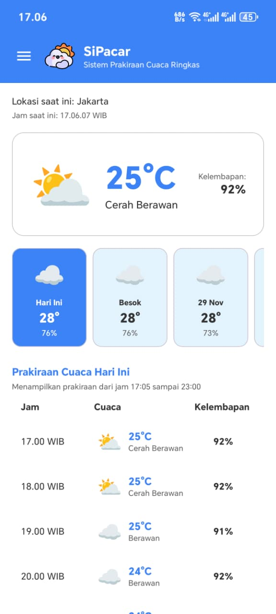
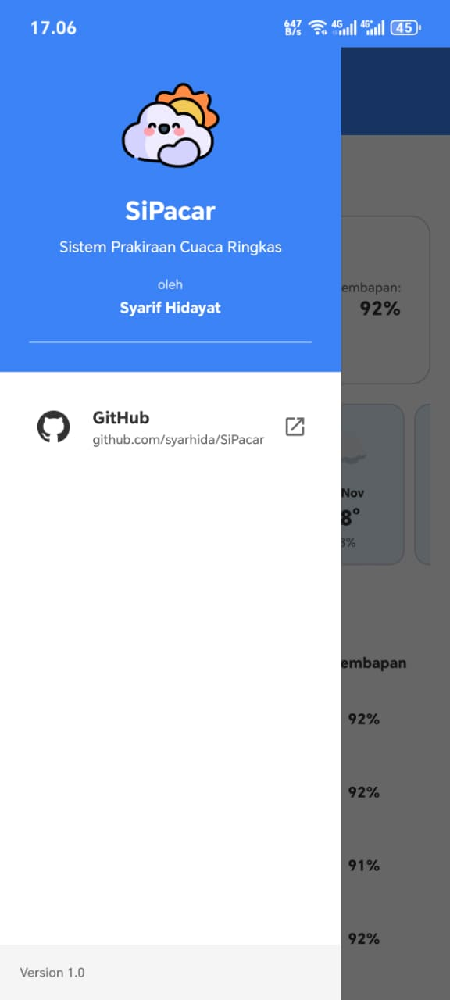
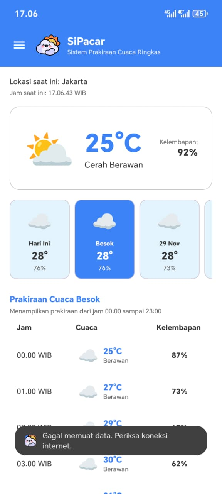

# SiPacar - Sistem Prakiraan Cuaca Ringkas

Aplikasi Android untuk menampilkan prakiraan cuaca Jakarta dengan interface yang simpel dan modern.

## 📱 Tentang Aplikasi

**SiPacar** (Sistem Prakiraan Cuaca Ringkas) adalah aplikasi prakiraan cuaca untuk wilayah Jakarta yang menampilkan informasi cuaca per jam dengan antarmuka yang clean dan mudah digunakan.

## 📸 Preview

  
  
  

## ⬇️ Download

Initial release (v1.0) sudah dapat di unduh

[](https://github.com/syarhida/SiPacar/releases/tag/v1.0)

### Fitur Utama

- 🌡️ Menampilkan suhu realtime dengan card besar
- 🕐 **List cuaca per jam** dengan format Indonesia
- 💧 Menampilkan **kelembapan** untuk setiap data cuaca
- 🎨 UI Modern dengan tema Putih & Biru
- 🔄 Pull-to-refresh untuk memperbarui data
- 📱 Mobile responsive design

## 🛠️ Teknologi

- **Language**: Kotlin
- **Architecture**: MVVM (Model-View-ViewModel)
- **Networking**: Retrofit + Gson
- **UI**: Material Design 3, ViewBinding, RecyclerView, CardView
- **Async**: Kotlin Coroutines + LiveData
- **API**: [Open-Meteo Weather API](https://open-meteo.com/)

## 📦 Package Structure

```
com.syarhida.sipacar
├── data
│   ├── api
│   │   ├── WeatherApiService.kt
│   │   └── RetrofitInstance.kt
│   ├── model
│   │   ├── WeatherResponse.kt
│   │   └── WeatherItem.kt
│   └── repository
│       └── WeatherRepository.kt
└── ui
    ├── MainActivity.kt
    ├── adapter
    │   └── WeatherAdapter.kt
    └── viewmodel
        └── WeatherViewModel.kt
```


## 📋 Requirements

- Android Studio Arctic Fox atau lebih baru
- Minimum SDK: 24 (Android 7.0)
- Target SDK: 34 (Android 14)
- JDK 17

## 🌐 API

Aplikasi ini menggunakan [Open-Meteo Weather API](https://open-meteo.com/):
```
https://api.open-meteo.com/v1/forecast?latitude=-6.2&longitude=106.8&hourly=temperature_2m,relative_humidity_2m,weathercode&forecast_days=7
```

**Parameter API:**
- `latitude=-6.2` & `longitude=106.8` - Koordinat Jakarta
- `hourly=temperature_2m,relative_humidity_2m,weathercode` - Data suhu, kelembapan, dan kode cuaca per jam
- `forecast_days=7` - Prakiraan 7 hari

## 📝 Lisensi

Project ini dibuat untuk keperluan Tugas 2 Mata Kuliah Pemrograman Berbasis Piranti Bergerak.

## 👨‍💻 Developer

Dibuat dengan ❤️ menggunakan Kotlin

---

**SiPacar** - Prakiraan Cuaca Jakarta, Simple & Akurat! 🌤️

